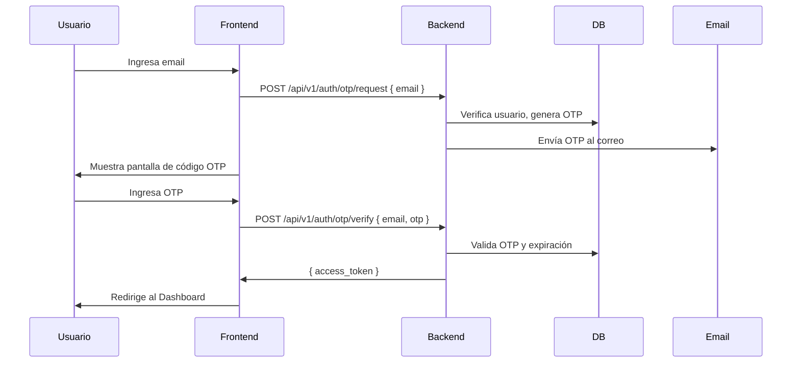

# Arquitectura propuesta para MVP de gestión de citas

## 1. Visión general de la arquitectura

Se recomienda un **monolito modular** con separación clara por responsabilidades:

- **Frontend**: Next.js (App Router) + Tailwind CSS.
- **Backend**: FastAPI async, organizado por módulos de dominio y capas.
- **Base de datos**: PostgreSQL.
- **Autenticación**: OTP por correo, sin contraseña para acceso de clientes y administrador.
- **Infraestructura**: Docker Compose para desarrollo y Dockerfiles para producción.

Vista de alto nivel:

1. Next.js renderiza interfaz pública (cliente) y panel interno (admin).
2. Next.js consume API REST de FastAPI.
3. FastAPI aplica reglas de negocio vía casos de uso.
4. Casos de uso acceden a repositorios (PostgreSQL).
5. Módulo de identidad genera y valida OTP, y usa servicio de correo.
6. Módulo de agenda gestiona servicios, reglas, bloques y citas.

Esta arquitectura permite entregar rápido sin perder mantenibilidad, y deja camino para crecer sin migrar a microservicios.

## 2. Principios arquitectónicos

- **Modularidad pragmática**: separar por dominios del negocio (`identity`, `services`, `scheduling`, `appointments`) evita acoplamiento y facilita cambios.
- **Separación de capas**:
  - `presentation` (endpoints)
  - `application` (casos de uso)
  - `domain` (entidades, reglas)
  - `infrastructure` (ORM, correo, persistencia)
- **Responsabilidad única realista**: cada caso de uso resuelve una intención concreta (`BookAppointment`, `ConfirmAppointment`, etc.).
- **Dependencia de abstracciones donde aporta valor**: repositorios e interfaz de email OTP como puertos; no abstraer todo.
- **Simplicidad del MVP**: sin eventos distribuidos, sin CQRS, sin colas obligatorias, sin arquitectura hexagonal estricta.

## 3. Estructura del backend

### 3.1 Capas recomendadas

- `presentation/api`: routers FastAPI, validación de entrada/salida (Pydantic DTOs).
- `application`: casos de uso, orquestación, control transaccional.
- `domain`: entidades del UML, value objects simples, reglas de negocio.
- `infrastructure`: SQLAlchemy/SQLModel, repositorios concretos, proveedor SMTP, settings.

### 3.2 Módulos del dominio

- `identity`: `AdminUser`, `Client`, OTP login.
- `catalog`: `Service`.
- `availability`: `ServiceAvailabilityRule`, `ServiceTimeBlock`.
- `appointments`: `Appointment` y su ciclo de estados.

### 3.3 Dónde vive cada cosa

- **Entidades**: `app/domain/<modulo>/entities.py`
- **Casos de uso**: `app/application/<modulo>/use_cases/*.py`
- **Repositorios (interfaces)**: `app/application/<modulo>/ports.py`
- **Repositorios (implementación)**: `app/infrastructure/persistence/<modulo>_repository.py`
- **Esquemas HTTP (DTOs)**: `app/presentation/api/schemas/*.py`
- **Endpoints**: `app/presentation/api/routes/*.py`
- **Infraestructura transversal**: `app/infrastructure/email`, `app/infrastructure/security`, `app/infrastructure/db`

### 3.4 Qué abstraer y qué no

Sí abstraer:

- Repositorios (para desacoplar casos de uso de ORM).
- Servicio OTP/email (`OtpSender`, `OtpStore`, `TokenIssuer`).

No abstraer en MVP:

- Un bus de eventos genérico.
- Factorías complejas para entidades simples.
- Patrón Specification salvo que aparezcan filtros realmente complejos.

## 4. Estructura del frontend

### 4.1 Organización por rutas (App Router)

- `(public)`:
  - `/login`
  - `/verify-otp`
  - `/services`
  - `/services/[serviceId]/slots`
- `(client)`:
  - `/my-appointments`
- `(admin)`:
  - `/admin/services`
  - `/admin/availability`
  - `/admin/appointments`

### 4.2 Separación UI, lógica y datos

- `app/...`: páginas y layouts por ruta.
- `features/<feature>/components`: componentes de cada módulo.
- `features/<feature>/hooks`: hooks (`useAvailableSlots`, `useOtpAuth`).
- `features/<feature>/services`: cliente API por caso de uso.
- `shared/ui`: componentes reutilizables.
- `shared/lib`: utilidades y config.

### 4.3 Manejo de OTP

Flujo recomendado:


Para MVP, priorizar cookie HttpOnly + CSRF simple para panel admin y cliente.

### 4.4 Conexión con API

- Un `apiClient` central (fetch wrapper) con manejo de errores común.
- DTOs tipados en TypeScript alineados a contratos OpenAPI.
- Evitar que componentes UI llamen `fetch` directo: usar capa `services`.

## 5. Modelo de dominio del MVP

Entidades base (manteniendo UML):

- `AdminUser`: usuario interno único del negocio.
- `Client`: usuario final autenticado por OTP.
- `Service`: define servicio, duración y modo de confirmación.
- `ServiceAvailabilityRule`: regla semanal base por servicio.
- `ServiceTimeBlock`: bloque horario concreto reservable con estado operativo.
- `Appointment`: reserva transaccional con snapshot histórico del cliente.

Cómo viven conceptualmente:

- `Service`, `ServiceAvailabilityRule` y `ServiceTimeBlock` forman el núcleo de disponibilidad.
- `Appointment` representa la ocupación real del bloque.
- `Client` y `AdminUser` pertenecen al contexto de identidad/acceso.

Ajustes mínimos sugeridos sobre UML:

- Como la autenticación es OTP sin contraseña, `password_hash` en `Client` y `AdminUser` puede reemplazarse por `null`/deprecado o cambiarse por metadatos OTP. Mantenerlo físicamente al inicio es válido para no romper migraciones tempranas.

## 6. Flujo de comunicación entre componentes

Ejemplo completo: login OTP, reserva y confirmación admin.

1. Cliente en frontend solicita OTP (`/api/v1/auth/otp/request`).
2. Endpoint `POST /api/v1/auth/otp/request` recibe email.
3. Caso de uso `RequestOtpLogin` genera OTP con expiración y lo persiste (`otp_challenges`).
4. Infraestructura de email envía código.
5. Cliente envía OTP (`POST /api/v1/auth/otp/verify`).
6. Caso de uso `VerifyOtpLogin` valida OTP, crea sesión y retorna credenciales.
7. Cliente consulta servicios (`GET /api/v1/services`).
8. Endpoint llama `ListActiveServices` y retorna catálogo.
9. Cliente consulta horarios (`GET /api/v1/services/{service_id}/time-blocks?date=...`).
10. Caso de uso `ListAvailableTimeBlocks` obtiene bloques `available` y excluye bloques con cita activa.
11. Cliente reserva (`POST /api/v1/appointments`).
12. Caso de uso `BookAppointment` valida bloque, crea `Appointment` con snapshots (`name/email/phone`) y marca ocupación lógica vía cita activa.
13. Admin consulta citas (`GET /api/v1/appointments?status=pending_review` - requires admin role).
14. Admin confirma (`PATCH /api/v1/appointments/{appointment_id}/confirm` - requires admin role).
15. Caso de uso `ConfirmAppointment` cambia estado a `confirmed`, setea `confirmed_at`, persiste.

Capas implicadas en cada operación:

- Frontend -> Endpoint FastAPI -> Use case (application) -> Entidades/reglas (domain) -> Repositorio (infra) -> PostgreSQL.
- Para OTP: Use case -> Email provider SMTP/API.

## 7. Estructura del repositorio

Estructura propuesta del repo completo:

```text
citas-app/
  architecture.md
  api.md
  backend.md
  database.md
  devops.md
  security.md
  implementacion.md
  frontend.md
  README.md
  .env.example
  docker/
    backend.Dockerfile
    frontend.Dockerfile
    nginx.conf
  docker-compose.yml
  scripts/
    dev-up.sh
    dev-down.sh
    format.sh
    lint.sh
    test.sh
  docs/
    decisions/
      0001-modular-monolith.md
      0002-otp-auth.md
    api/
      openapi.yaml
    domain/
      uml.puml
  backend/
    pyproject.toml
    alembic.ini
    migrations/
    app/
      main.py
      core/
        config.py
        security.py
        dependencies.py
      presentation/
        api/
          routes/
            auth.py
            services.py
            availability.py
            appointments.py
            admin_appointments.py
          schemas/
            auth.py
            service.py
            availability.py
            appointment.py
      application/
        identity/
          use_cases/
            request_otp_login.py
            verify_otp_login.py
          ports.py
        catalog/
          use_cases/
            create_service.py
            list_services.py
          ports.py
        availability/
          use_cases/
            create_rule.py
            generate_time_blocks.py
            list_available_blocks.py
          ports.py
        appointments/
          use_cases/
            book_appointment.py
            confirm_appointment.py
            cancel_appointment.py
            list_appointments.py
          ports.py
      domain/
        identity/
          entities.py
          enums.py
        catalog/
          entities.py
          enums.py
        availability/
          entities.py
          enums.py
          services.py
        appointments/
          entities.py
          enums.py
          policies.py
      infrastructure/
        db/
          models.py
          session.py
        persistence/
          identity_repository.py
          service_repository.py
          availability_repository.py
          appointment_repository.py
        email/
          smtp_sender.py
        auth/
          otp_store.py
          token_service.py
    tests/
      unit/
      integration/
  frontend/
    package.json
    next.config.ts
    tailwind.config.ts
    src/
      app/
        (public)/
          login/page.tsx
          verify-otp/page.tsx
          services/page.tsx
          services/[serviceId]/slots/page.tsx
        (client)/
          my-appointments/page.tsx
        (admin)/
          admin/services/page.tsx
          admin/availability/page.tsx
          admin/appointments/page.tsx
        layout.tsx
        globals.css
      features/
        auth/
          components/
          hooks/
          services/
        services/
          components/
          hooks/
          services/
        availability/
          components/
          hooks/
          services/
        appointments/
          components/
          hooks/
          services/
      shared/
        ui/
        lib/
        types/
      middleware.ts
```

## 8. Patrones recomendados

Sí recomendar:

- **Modular Monolith**: separación por módulos de negocio sin costo operativo de microservicios.
- **Repository**: desacopla dominio/casos de uso del ORM y facilita tests.
- **Use Case / Application Service**: organiza la lógica por acciones del negocio.
- **DTOs (Pydantic + TS types)**: contratos claros entre frontend y backend.
- **Dependency Injection ligera** (FastAPI Depends): útil para inyectar repositorios y servicios de OTP.
- **Domain services puntuales**: por ejemplo, generador de bloques de tiempo.
- **Policy objects simples**: reglas como "se puede reservar este bloque" o "se puede confirmar esta cita".

No recomendar (por ahora):

- Microservicios.
- Event sourcing/CQRS.
- DDD táctico completo con demasiadas capas ceremoniales.
- Bus de dominio genérico y complejo.

## 9. Buenas prácticas clave

- Mantener transacciones cortas en operaciones críticas (`BookAppointment`, `ConfirmAppointment`).
- Agregar restricciones de integridad en BD para evitar doble reserva de bloque activo.
- Versionar esquema con Alembic desde el día 1.
- Exponer OpenAPI y generar tipos frontend cuando sea posible.
- Centralizar manejo de errores de dominio -> respuestas HTTP consistentes.
- Registrar auditoría mínima (`who`, `when`, `action`) para acciones admin.
- Configuración por entorno con `pydantic-settings` y `.env`.
- Pruebas mínimas obligatorias:
  - unitarias de reglas de disponibilidad/estado.
  - integración de endpoints críticos de auth y reservas.
- Idempotencia básica en `request OTP` (rate limit por email).
- Normalizar fechas en UTC en backend y convertir en frontend.

## 10. Riesgos y errores comunes

- Sobrediseñar desde el inicio (arquitectura enterprise para un MVP pequeño).
- Mezclar modelos ORM directamente en lógica de dominio y casos de uso.
- Hacer endpoints “anémicos” sin casos de uso (lógica dispersa en routers).
- Acoplar frontend a detalles internos de tablas/ORM en vez de contratos API.
- No considerar concurrencia al reservar bloques (riesgo de doble booking).
- No guardar snapshots del cliente en `Appointment`.
- Diseñar primero para multi-tenant o alta escala sin necesidad actual.
- Ignorar observabilidad básica (logs estructurados y trazabilidad simple).

## 11. Versión recomendada de arquitectura final

Decisión final sugerida para ejecutar:

1. Construir un **monolito modular** con FastAPI + PostgreSQL + Next.js.
2. Organizar backend por módulos de dominio y capas (`presentation`, `application`, `domain`, `infrastructure`).
3. Implementar autenticación OTP por correo en módulo `identity`.
4. Implementar flujo completo de reservas con reglas del UML sin rediseñarlo.
5. Dockerizar todo con `docker-compose` para entorno local reproducible.
6. Asegurar calidad con pruebas unitarias clave + integraciones de endpoints críticos.

Resultado: una base limpia, implementable en corto plazo, mantenible y preparada para crecer sin sobreingeniería.

---

## Estructura concreta inicial (lista para arrancar)

Backend (FastAPI):

```text
backend/
  app/
    main.py
    presentation/api/routes/
    presentation/api/schemas/
    application/
    domain/
    infrastructure/
  migrations/
  tests/
  pyproject.toml
```

Frontend (Next.js):

```text
frontend/
  src/
    app/
    features/
    shared/
  package.json
  next.config.ts
  tailwind.config.ts
```
